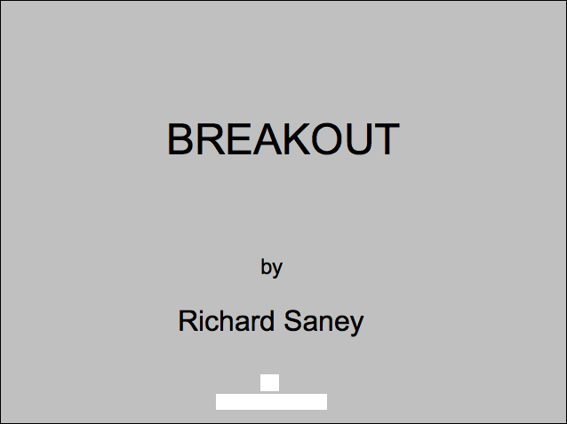
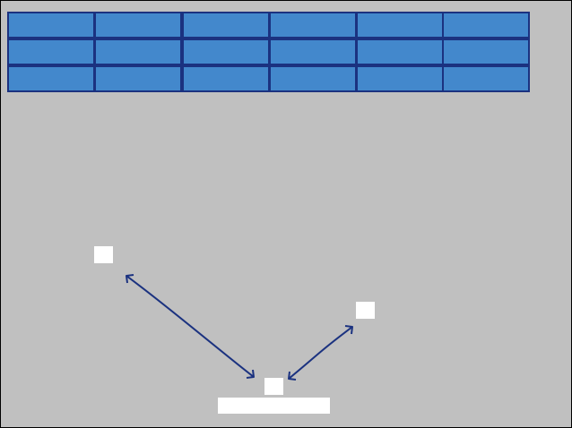
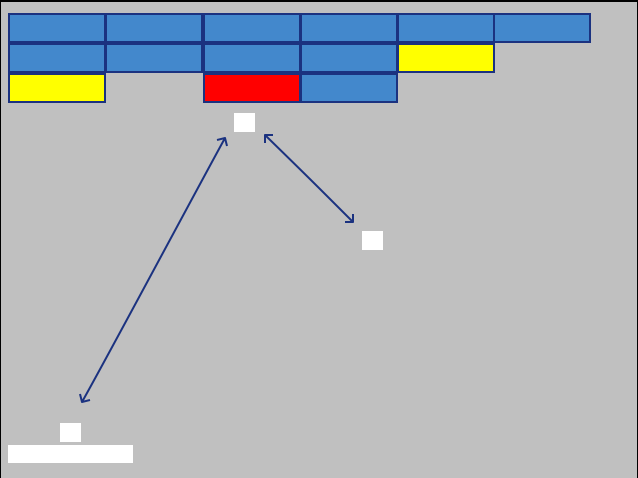
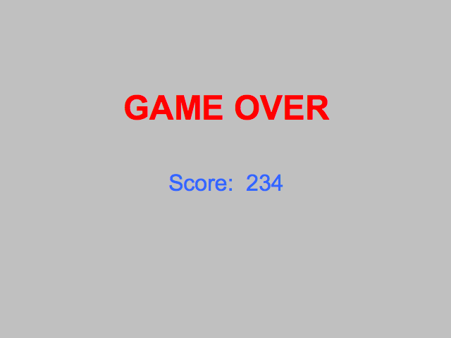

# GUI Mockup

Here are 4 basic phases the game will go through.

## Before Game Starts

The game begins with the Title "BREAKOUT" and author name.

The Ball and Paddle are also visible from the beginning, though immovable. 

## Reflecting Ball from Paddle

The Ball will bounce off of the paddle, swapping the y-direction of the ball, leaving x unchanged. 

## Breaking One Brick

Whenever a Brick is ricocheted off of, it switches to the next damaged state. 

## Game Over Screen

The Game over screen says "GAME OVER" and the final score.

##Additional Changes

Breakout will also display the count of lives, level, and the current score somewhere, likely above the Blocks.
There may also be a display of controls option, or the controls will always be on screen.
An additional animation sequence at the very beginning would be nice. Also, the background is going to be solid black. 